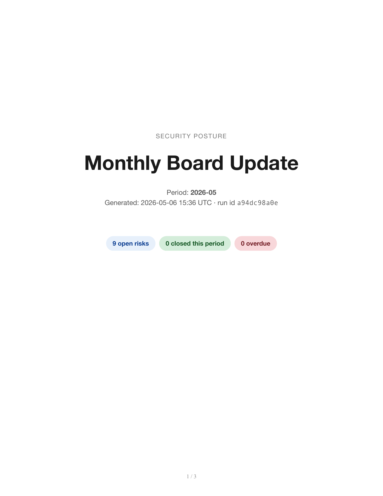
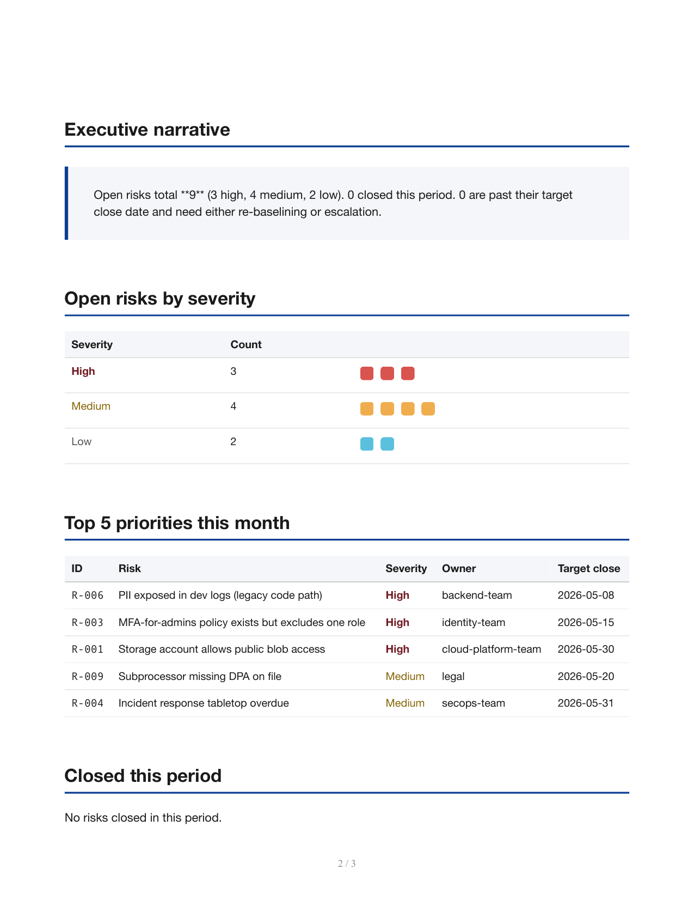

# vciso-assistant

[](https://github.com/anthonyonazure/vciso-assistant/actions/workflows/tests.yml)
[](https://www.python.org/)
[](https://github.com/langchain-ai/langgraph)
[](LICENSE)

Interactive vCISO. Slack-first bot that answers ad-hoc policy questions, maintains a YAML-driven risk register, and generates polished monthly board updates with hash-stamped PDFs.

## What it does

Three loops, one knowledge base:

**1. Slack Q&A** — engineers `@vciso do we require MFA for vendor accounts?` get an answer in-thread within seconds, with citations to specific policy entries (`KB-IAM-MFA`) and any open risks (`R-003`) the question touches. Refuses to fabricate — when the KB has nothing, replies "open a policy ticket."

**2. Risk register tracking** — open risks flow in from the [compliance-evidence-agent](https://github.com/anthonyonazure/compliance-evidence-agent) (failed controls become risks), from incidents, from audits. Stored in SQLite with category, severity, owner, target close. The bot uses these as a second retrieval surface during Q&A.

**3. Monthly board updates** — `vciso board-update` produces a multi-page PDF: cover with headline metrics, executive narrative (LLM, with stub fallback), open risks by severity, top 5 priorities, closures this period, overdue list. SHA-256 sidecar for tamper evidence.

### Sample monthly board update

<p>
  
  
  
</p>

## Quick start

```bash
cd ../b2b-agent-toolkit && pip install -e ".[dev]" && cd -
pip install -e ".[dev]"
cp .env.example .env

# 1. Seed the local risk register with 10 sample risks
vciso seed

# 2. Ask a question (CLI mirror of the Slack bot)
vciso ask "do we require MFA for all employees?"

# 3. Generate a monthly board update PDF
vciso board-update

# 4. Run the Slack endpoint (exposes /slack/events)
vciso slack-bot
```

Configure your Slack app:
- Event Subscriptions → request URL: `https://your-host/slack/events`
- Subscribe to bot events: `app_mention`, `message.im`
- Bot Token Scopes: `chat:write`, `app_mentions:read`, `im:history`, `im:read`, `im:write`
- Set `VCISO_SLACK_BOT_TOKEN` + `VCISO_SLACK_SIGNING_SECRET` in `.env`

## Layout

```
knowledge_base/cyber_co.yaml    # 8 seed policy entries (extend with your real KB)
risk_register/seed.yaml          # 10 sample risks
src/vciso/
├── db.py                        # SQLAlchemy: Risk + BoardUpdate
├── seed.py                      # YAML → DB
├── qa.py                        # KB retrieval + open-risk retrieval + LLM compose with stub fallback
├── board_update.py              # monthly PDF generator with hash sidecar
├── slack_bot.py                 # FastAPI /slack/events with signature verification
└── cli.py                       # `vciso seed | ask | board-update | slack-bot`
templates/board_update.html      # WeasyPrint board-update template
```

## Why this is hard to fake

1. **Citations are required by construction.** The LLM prompt mandates JSON with `kb_citations` / `risk_citations`. When neither is supported, it explicitly says so — no vague pivots.
2. **The risk register is the second retrieval surface.** Questions like "what are we doing about public storage?" surface the actual open risk (`R-001`), not just a generic policy snippet.
3. **The board update is reproducible.** Same risk register state → same PDF (modulo timestamps). Hash sidecar makes it auditor-grade.
